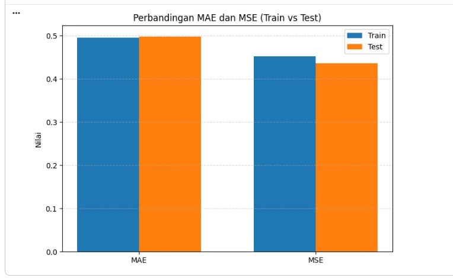

# Prediksi Durasi Tidur Menggunakan Multi-Layer Perceptron

## 📌 Deskripsi Project
Project ini bertujuan untuk memprediksi durasi tidur berdasarkan kebiasaan harian menggunakan algoritma Multi-Layer Perceptron (MLP). 

Model menganalisis berbagai faktor gaya hidup seperti screen time, frekuensi olahraga, konsumsi minuman tertentu, dan kebiasaan lainnya yang dapat mempengaruhi durasi tidur seseorang.

---

## 📊 Dataset
Dataset diperoleh melalui kuesioner Google Form yang disebarkan kepada mahasiswa aktif Program Studi Sains Data ITERA angkatan 2021–2025.

### Fitur Dataset:
- Usia
- Jenis Kelamin
- Frekuensi Makan
- Screen Time
- Blue Light Filter
- Posisi Tidur
- Frekuensi Olahraga
- Kebiasaan Rokok/Alkohol
- Jenis Minuman yang Sering Dikonsumsi

### Target:
- Durasi Tidur (Jam)

---

## 🛠 Tools dan Teknologi
- Python
- Pandas
- NumPy
- Scikit-learn
- TensorFlow / Keras
- Matplotlib
- Jupyter Notebook

---

## ⚙️ Metodologi
1. Data Cleaning
2. Encoding Data Kategorik
3. Normalisasi Min-Max Scaling
4. Train-Test Split (80:20)
5. Pemodelan Multi-Layer Perceptron
6. Hyperparameter Tuning
7. Evaluasi Model menggunakan MAE dan MSE

---

## 🧠 Arsitektur Model
- Input Layer
- Hidden Layer dengan 64 neuron
- Fungsi aktivasi Tanh
- Optimizer Adam

---

## 📈 Hasil Evaluasi
Model menghasilkan performa yang stabil dengan:
- MAE sekitar 0.49–0.50 jam
- MSE sekitar 0.44–0.45 jam²

Hasil menunjukkan bahwa model mampu melakukan generalisasi dengan baik tanpa overfitting yang signifikan.

---

## 📷 Visualisasi
### Perbandingan Nilai Aktual dan Prediksi

## 👩‍💻 Author
- Elia Meylani Simanjuntak
- Rut Junita Sari Siburian
- Rafa Aqilla Jungjunan
